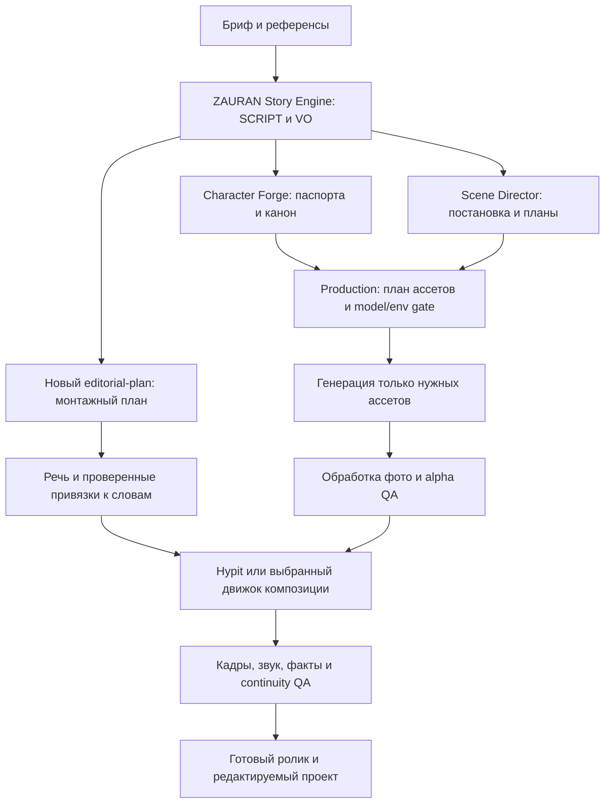

# Схема интеграции с ZAURAN-AI-CREATIVE

Это проект подключения, а не изменения вашего репозитория. Основан на прочитанном снимке ZAURAN `fcfaf15952347c4616d30e78e21e3b671e4142ea`, документации Hypit и brag. Практический рендер и сравнение качества пока не выполнены.

## Рекомендация

Сохранить ZAURAN как источник сценария, канона, персонажей и постановки. Добавить между подготовкой ассетов и финальным выпуском слой редакторского плана. Основной кандидат для монтажа от референса — Hypit; для промо существующего продукта — brag; для библиотеки управляемой графики — один выбранный движок Remotion или HyperFrames. Не подключать все движки одновременно в первом прототипе.

| Задача | Инструмент | Что реально даёт | Ограничение |
|---|---|---|---|
| Референс → редактируемый ролик | [Hypit](https://github.com/hypit-ai/hypit) | Workflow с кадрами, графикой, B-roll, подписями, привязками к словам; подключаемые провайдеры | Воссоздание зависит от разбора и ассетов. Маркетинговое обещание «100M views» не является результатом проверки |
| Промо по репозиторию / сайту | [brag и brag-slim](https://github.com/latent-spaces/brag) | Изучение продукта, угол подачи, короткий проморолик; полный вариант использует HyperFrames | Это специализированный промопайплайн. Нельзя принимать сгенерированные claims за проверенные факты |
| React-композиции | [Remotion skills](https://github.com/remotion-dev/skills) | Правила работы с Remotion, типографикой, сценами и рендером | Пакет навыков не равен всей монтажной системе; условия лицензии Remotion проверяются отдельно |
| HTML/GSAP-композиции | [HyperFrames](https://github.com/heygen-com/hyperframes) | Кодовая графика и видеокомпозиции | Нужны совместимые Node/FFmpeg и контроль воспроизводимости |
| Объясняющая анимация | [Motion Canvas](https://github.com/motion-canvas/motion-canvas) | Программные сцены и визуализация идей | Требует разработки композиции; не гарантирует автоматический разбор любого референса |
| Ручная доводка | [After Effects MCP](https://github.com/HeroicSwan/after-effects-mcp), [Resolve MCP](https://github.com/samuelgursky/davinci-resolve-mcp) | Управление соответствующим установленным редактором | Потребуются редактор, совместимость и проверка конкретных команд |
| Вырезка фото | [rembg](https://github.com/danielgatis/rembg) + [BiRefNet](https://github.com/ZhengPeng7/BiRefNet) | Локальная обработка и модель сегментации | Качество волос, стекла и мягких краёв проверяется на своих материалах |

Skillry использовать как каталог приёмов и инструкций: искать подходящий визуальный мотив, читать requiredInputs/notFor/dependencies, затем переносить механику в собственную композицию. Наличие превью не означает доступ к установочному пакету.

## Пайплайн



Уже существующие `story-production-contract.md` и `script-to-assets.md` требуют сохранения утверждённого SCRIPT, стабильных ID, состояния и результатов проверок. Новый монтажный слой должен ссылаться на них. Не вводить второе независимое STATE, не переписывать сценарий ради удобства рендера, не смешивать «утверждён» и «проверен».

## Минимальные новые навыки в skills/

1. `zauran-editorial-planner`: переводит утверждённый SCRIPT в сцены, функции каждого кадра, мотивы графики, входные ассеты и монтажные события. Выход — `edit-plan.json` и список вопросов. Не генерирует медиа.
2. `zauran-reference-breakdown`: описывает структуру референса: hook, смены планов, титры, графику, звук, темп, доказательства. Различает наблюдаемые элементы и догадки. Выход — reusable style/mechanics spec.
3. `zauran-asset-processing`: выбирает подготовку фото, cutout, маску, размеры и формат. Сохраняет исходник; выдаёт производный ассет, provenance и QA. Гарантия «идеальной вырезки» запрещена без проверки.
4. `zauran-motion-composer`: собирает редактируемую композицию из edit plan через выбранный backend. Учитывает версии сценария, шрифты, safe zones, локальный кэш и fallback.
5. `zauran-video-review`: оценивает монтаж по рубрике: ясность, иерархия, читаемость, continuity, края alpha, speech anchors, loudness, факты. Выдаёт замечания с кадром/таймкодом.

Провайдеры генерации остаются в production-навыке: editorial planner запрашивает ассет и его требования, production выбирает поддерживаемую модель после model/environment gate. Запуск платных генераций — отдельное решение по бюджету.

## Контракт данных

```json
{
  "project_id": "promo_001",
  "script_version": "SCRIPT_v3_approved",
  "style_profile": "editorial_explainer",
  "format": {"width": 1080, "height": 1920, "fps": 30},
  "shot_id": "SHOT_04",
  "purpose": "Показать изменение во времени",
  "script_beat_id": "BEAT_02",
  "character_ids": ["CHAR_01"],
  "asset_ids": ["ASSET_portrait_01", "ASSET_chart_data_01"],
  "renderer": "hypit",
  "visual_route": "code_motion",
  "anchor": {"kind": "word", "token_id": "VO_02_word_18", "alignment_status": "pending"},
  "motion": {"entry": "masked_reveal", "emphasis": "single_value_highlight", "exit": "match_cut"},
  "sound": {"voice_asset": "VO_02", "sfx_cue": "chart_reveal"},
  "approval_status": "draft",
  "qa_status": "not_checked",
  "source_refs": ["SOURCE_01"],
  "budget": {"generation_required": false, "approved_cost_cap": 0}
}
```

Это предложенная внутренная схема ZAURAN, не готовый SVML/API Hypit. Адаптер должен отдельно преобразовывать её в настоящий синтаксис выбранного движка. Упоминание слова недостаточно: слово может повторяться; используйте стабильный token ID + версию VO + speaker. После изменения текста/озвучки повторно выровнять речь, проверить missing/ambiguous anchors и только потом рендерить.

## Как делать ролики в редакционной манере Vox

Не ограничиваться жёлтым фоном и титрами. Сначала сформулировать тезис, затем показать доказательство, объяснить механизм и завершить выводом. Для каждого факта сохранить источник. Визуальные роли: карта места, диаграмма масштаба, выделенная цитата, документ, вырезанный объект, сравнение до/после, короткая причинная схема. На экране одновременно один основной тезис.

Большую часть такой графики выгодно собирать кодом: SVG-карты, подписи, графики, маски, панели, плавные камеры. Генерация нужна для отсутствующего предметного визуала или специально задуманной сцены. Данные графика задаются явно; нейросеть не должна рисовать выдуманные числа как факт.

Предложенный motion-профиль: ограниченная палитра, 2–3 типографических уровня, объясняющее появление объектов, акцент в момент слова, паузы для чтения, переходы по смыслу. Длительность hold рассчитывать по читаемости и проверять на устройстве. Это проект художественной системы, а не обещание качества редакции Vox.

## Персонажи и мультсцены

Character Forge уже решает разработку персонажа. Перед генерацией сохранять паспорт: силуэт, пропорции, цвета, лицо, костюм, отличия от остальных, допустимые эмоции, reference sheets. production получает passport ID и версию, scene director — положение и действие. Утверждённый внешний вид прикладывается как референс в поддерживаемой моделью форме; один только текст не гарантирует постоянство лица.

Порядок: концепты → утверждённый дизайн → ракурсы и выражения → тестовая сцена → проверка continuity → нужные шоты. Для простых движений часто достаточно слоёв персонажа и кодовой анимации; генеративное видео выбирать для действий, которые требуют меняющейся геометрии. Cutout персонажа готовится после утверждения дизайна, затем проверяется на нескольких фонах.

Шаблон задания ассета:

```text
ASSET_ID / SHOT_ID / SCRIPT_VERSION:
Назначение и связь со сценарием:
CHARACTER_ID + PASSPORT_VERSION + reference assets:
Действие, эмоция, ракурс, план и пространство:
Визуальный язык, палитра и форма:
Что обязано сохраняться: лицо, пропорции, костюм, реквизит:
Требования композиции: поля, разрешение, свободная зона для текста:
Фон: отдельный объект / сцена / последующее удаление:
Модель и окружение: только после проверки поддержки:
Критерии приёмки и случаи отклонения:
```

Negative prompts и transparent output добавлять только если провайдер их действительно поддерживает. Для генерации в текущем ChatGPT нужно использовать инструмент imagegen по его правилам; описанный внешний production pipeline выбирает свой провайдер отдельно.

## Проверка первого прототипа

Собрать три коротких проекта: 20-секундное промо репозитория через brag; 30-секундный explainer с вырезками и графиком; 15-секундный мультфрагмент с одним персонажем. Измерить стоимость, время рендера, число правок и сохраняемые версии. Проверить изменение текста/озвучки и повторяющиеся слова; найти все сломавшиеся anchors. Проверить возврат к предыдущему SCRIPT, отсутствие пропавших ассетов и сохранность исходных фото.

На визуальном ревью: пустые кадры, пропущенные слои, читаемость текста, safe zones, края волос, прозрачные предметы, ореолы, цвет, частота кадров. На звуке: отсутствие клиппинга, разборчивость речи, ducking музыки, синхронизация эффектов. На содержании: каждый claim подтверждён, цифры совпадают с источниками, канон персонажа сохранён. Порог качества уточнить по 2–3 вашим референсам после первого рендера.

Порядок внедрения: сначала единый edit plan и один backend; затем word alignment и reference breakdown; далее cutout processing и character continuity; последними batch-варианты и дополнительные редакторы. Пока это схема: ваш репозиторий не изменён, движки не установлены, платные задачи не запущены.
